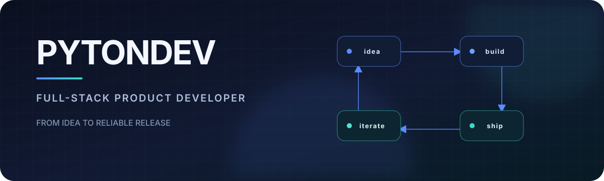

  

<h1 align="center">PyTonDev</h1>

<strong>Full-stack product developer</strong>

  I design and build web products, Telegram apps, and backend systems — 
  from first idea to reliable release.

## What I build

- **Web Products & SaaS** — practical interfaces and end-to-end product development.
- **Telegram Apps & Automation** — bots, workflows, and platform integrations.
- **APIs & Backend Systems** — reliable services, data flows, and infrastructure.

## Toolkit

**Frontend** · `TypeScript` `React` `Next.js`  
**Backend** · `Python` `FastAPI` `aiogram`  
**Data & Delivery** · `PostgreSQL` `Redis` `Docker`

## How I build

`Product thinking` · `End-to-end ownership` · `Reliable systems`
